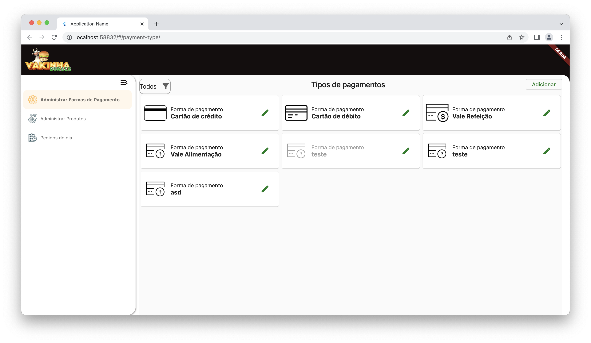
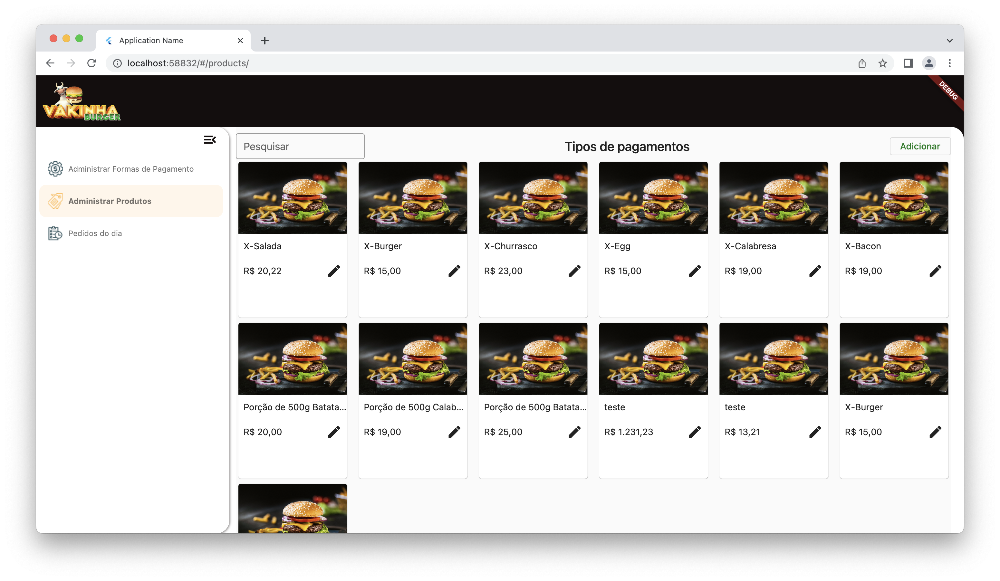
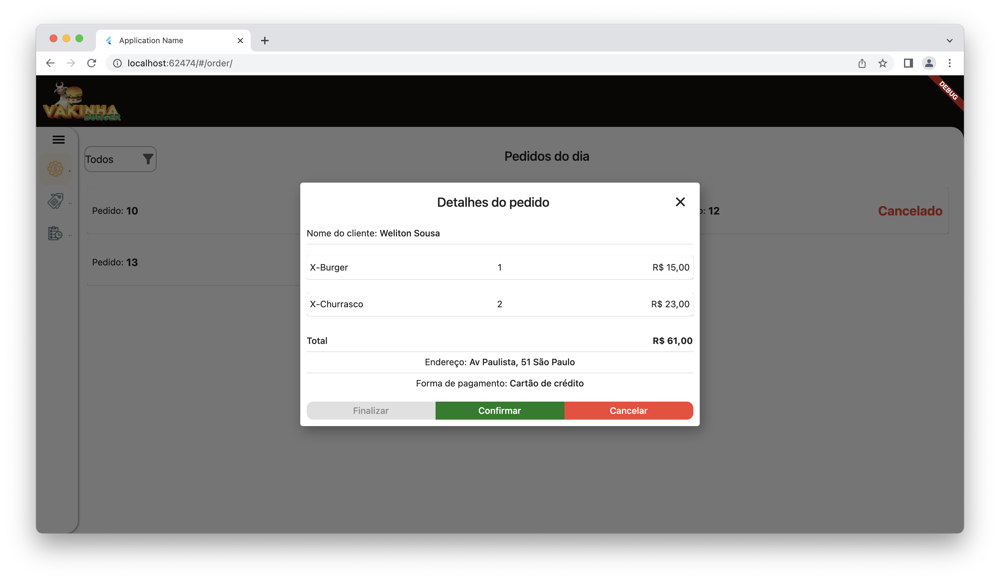

# Dart Week 10

<p align="center">
  
</p>

## Tecnologias

#### Arquitetura Limpa
A arquitetura limpa, também conhecida como Clean Architecture, é uma abordagem de desenvolvimento de software que visa separar as preocupações em camadas distintas, promovendo a modularidade, a testabilidade e a manutenibilidade do código. Neste projeto, foi utilizada essa arquitetura para alcançar uma estrutura clara e flexível, facilitando o desenvolvimento e a evolução contínua do aplicativo.

#### Flutter Modular
O Flutter Modular é um pacote do Flutter que facilita a implementação de injeção de dependência e a organização modular do código.

#### MobX
O MobX é uma biblioteca de gerenciamento de estado reativo para o Flutter, que ajuda a manter o estado do aplicativo sincronizado com a interface do usuário de forma simples e eficiente.


## Sobre

Este projeto tem como princípio atender os administradores, de forma que eles possam gerenciar:

- Formas de Pagamento
- Gerenciamento de Produtos
- Gerenciamento de Pedidos

## Imagens

<p align="center">
  
  
  
  
  
</p>


## Instalação

Este projeto foi desenvolvido utilizando a versão do flutter `3.10.0`

```bash
git clone https://github.com/welitonsousa/vakinha_burguer_web_gestor.git

flutter pub get

flutter run -d chrome --web-renderer html  
```

[MIT LICENSE](./LICENSE)


<br>
<br>
<p align="center">
   Feito com ❤️ by <a target="_blank" href="https://welitonsousa.shop"><b>Weliton Sousa</b></a>
</p>
